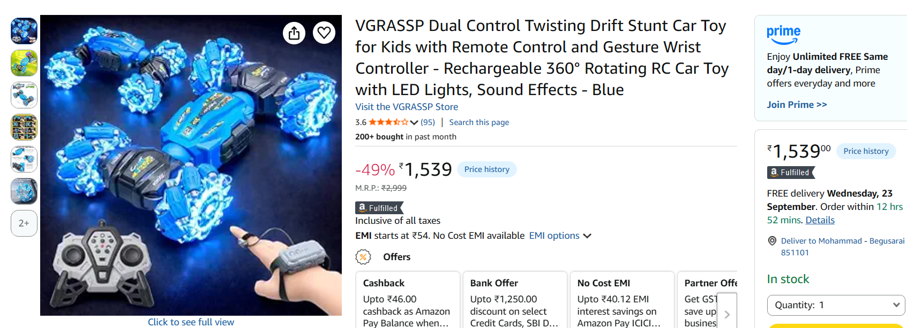
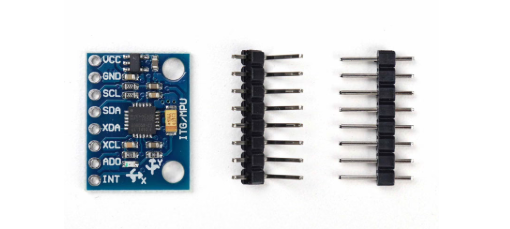
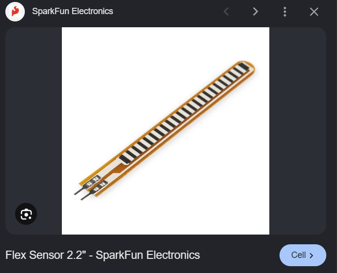
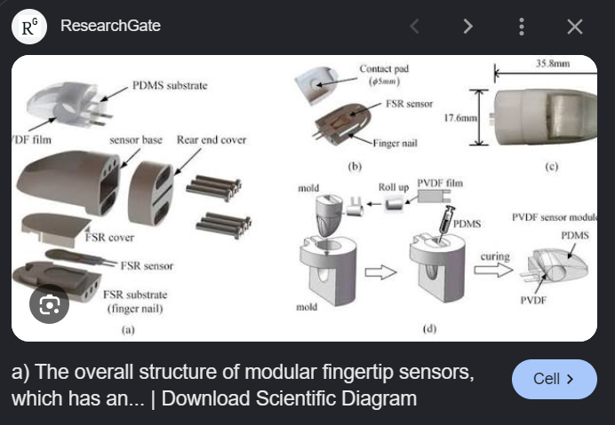
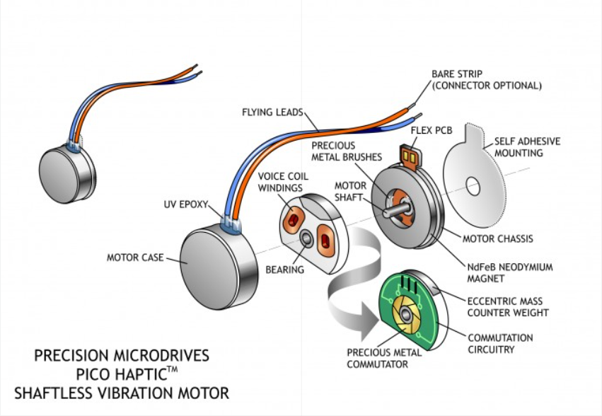
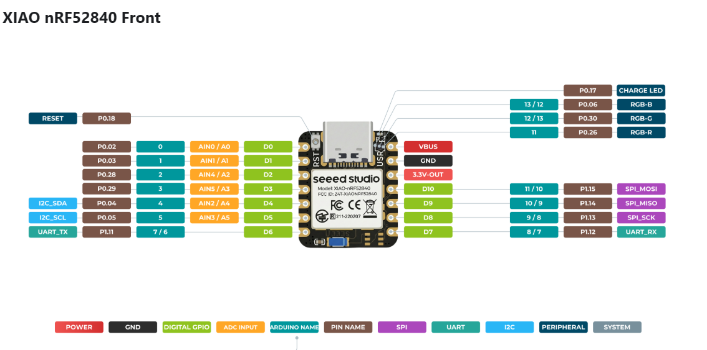

---

title: "Gemote"
author: "Mohammad Sarfaraz"
description: "Its a hand gesture remote which can control mouse pointers, clicks and srcoll edit"
created_at: "20-09-2026"

---

# September 20: Initial Journal/The Idea

Few months ago, My good friend [Ilham_Farooque](https://www.instagram.com/ilham_farooque/) got an idea to build a gyroscope based controller built in a handheld casing which would control the mouse pointer and clicks. 

So, he consulted me about his idea and we decided to work on it together after we were supposed to be done with our ongoing project. I remember I was making CYPRUS the split keyboard and he was working on some website for a CAFÉ.

Days passed then months and we litteraly never talked about it again except for posting few instagram stories. 

Coming back to the last night, I was thinking about some project ideas and I thought to myself I should try make something different this time, something where I can interact with physical world, something where I could put my knowledge of kinemetics and mechanics that I have learnt in highschool.

Then, BOOOOM — What better could be than making a hand gesture controlled car(Coming soon and its gonna be fire🔥🔥)!!
I decided to put the remote in gloves to get that expensive RC car vibe.

I have always wanted to get one of these!!!!!!!!! Never thought I would get to build it!!

Anyway, this project is a basic version of the remote I am going to be using in my RC car. Essentially its the combination of my design and his idea. The glove would monitor the hand gesture of the user and control the pointers and clicks on the monitor. 

**Total time spent: 0.4 hours**

# September 21: BOM and Workflow

I thought and thought then I used AI(i.e. Claude) to think and I thought more and so far I have come up with these features for my 'Gemote'.

* MPU-6050 — for monitoring rotational vector which would also be useful if I wanted to use this feature in my RC car remote.

* Flex Sensor — This is something I didnt know existed before I used Claude for parts requirement and I am glad I did. Basically its a device which changes its resistance depening on how much it is bent/flexed. So, I can use it on my fingers and palm to control stuffs like left click / right click. Or even I can use it to change modes without using any sort of push button.

* FSR fingertip pad — It is something that you wear at your finger tips and it detects the pressure applied on or by finger tips. Its mostly used in medical prosthetics which makes it even cooler!! SO, my plan is to use it so that I can register some input by pressing a finger by another. 

* Coin vibration motor — You can already guess by the name - its a small dc motor which I would use for feedback mechanism.

* Micro Controller — This is one the most crucial part of the design and I need to do it right. For now, I am choosing a board with good bluetooth capability since its a mouse. I am choosing Seeed XIAO nRF52840 instead of some Esp32 board because  
  One: It far excels in bluetooth capabilities than any Esp32 varient.  
  and Two: Its Seed Xiao so size wouldnt be an issue.   
The only issue is lower number of pins and I am likely going to need to use two of these boards, but we will see when we actually get to the build part. Maybe the cad would help me decide. 

* Power — Honestly I have yet not decided what to use to power the device. I guess I will decide it after I am done with the setup and coding. While its also high likely I will be using some sort of Rechargable Li-po battery.

* Others — Ofc gloves, fabrics, anything glvoes related and what not.

Also I wanted to say that I might change some components based on requirement.

---

Okay, now lets talk about how I am actually going to pull these off — **I DONT KN0W!!!!**     
First, I am gonna spend a week getting basics of C++ so that I can actually understand the moudues/libs that I am going to be using in firmware.   
Then I will start working on circuit part, I will make the schematics and if necessary a PCB. Then I will start coding the device which is actually the hardest yet the best part of the project.  
And then I will do some cad work for the body where all electronics will fit in and lastly I will put everything together on glove.  

Also, The workflow could change depending on what I feel like, so I guess you could say there is no workflow 😭😭. 

---

**Total time spent: 3.2 hours**

